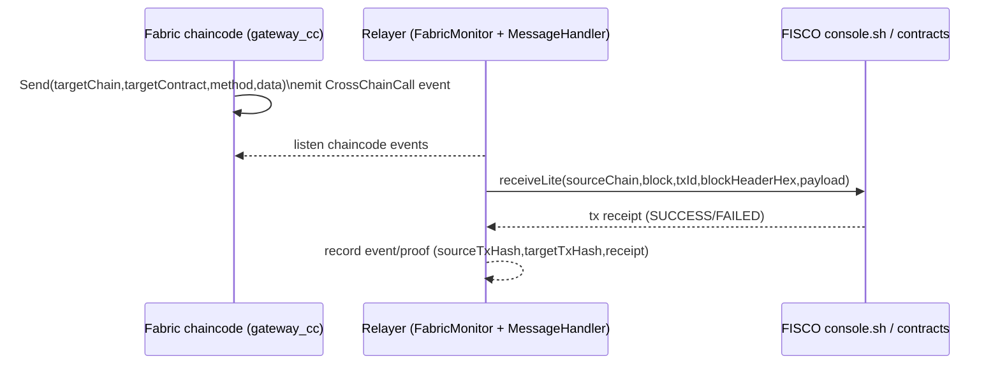
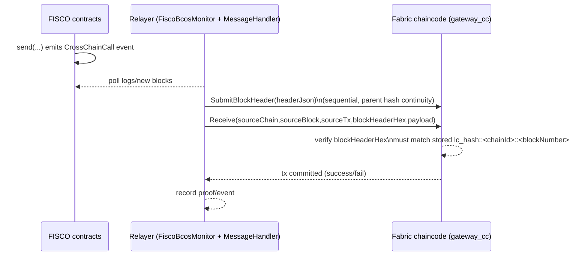
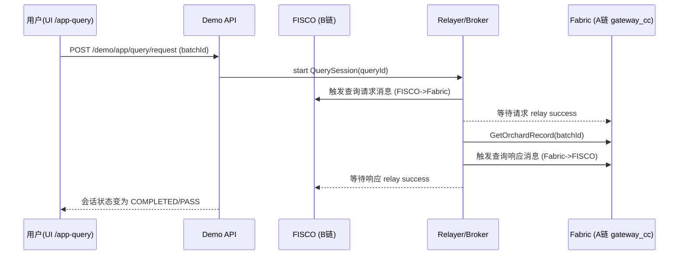

# 跨链演示平台架构概览（Fabric ↔ FISCO-BCOS）

本项目在 **不追求“完整跨链协议产品化”** 的前提下，构建了一个“可跑通 + 可演示 + 可观测”的跨链底座与上层应用演示平台。
当前重点有两条：

1. 双向跨链消息中继（Fabric ↔ FISCO-BCOS），并带轻量区块头验证（Lite）。
2. 面向演示的可视化界面：区块链浏览器页（运维视角）与跨链查询页（业务视角）。

---

## 1. 近期架构优化总结（发生了什么变化）

### 1) Demo 平台“分层化”
早期 Demo 逻辑容易集中在一个文件里（路由 + 会话状态机 + 事件聚合 + 等待回执混在一起），不利于稳定性修复与后续协议创新。

现在 Demo 平台按职责拆成了清晰的层（目录：`fabric-chaincode/Relayer/demo/`）：

- `api/`：HTTP 路由与参数校验（对外接口层）
- `broker/`：跨链编排（例如跨链查询 request → fetch → response）
- `session/`：Query Session 状态机与一致性规则（只管“状态怎么变”）
- `store/`：内存/SQLite 存储抽象（默认 memory，可切 SQLite）
- `app/`：组装与门面（`RelayFacade`，为后续协议创新留“可替换点”）
- `events/`：事件与 SSE（前端实时流）

### 2) “结果可判定”能力补齐
除了“触发成功”，新增了可对账/可追踪的视图与数据结构：

- `/explorer`：链状态 + 最近区块摘要 + 方向标记（Lite 浏览器）
- `/app-demo`：跨链触发与 proof cards（对账卡：源链证据 vs 目标链证据）
- `/app-query`：跨链查询会话（状态机 + 证据 + 返回数据）

### 3) 启动/测试更稳定
围绕 WSL + Docker + 代理环境做了多处“容错”：

- `start-all.sh`：清理 localhost 代理环境变量、防 Docker 代理坑、必要时降级（couchdb → goleveldb）。
- `scripts/start-demo.sh`：强制清理残留 relayer/vite 进程；健康检查；打印 Windows 访问 URL。
- `verify-crosschain.sh`：回归测试会重启 relayer；如果 demo API 原本在跑，会带上 `DEMO_API_ENABLED=true`，避免测试跑完 demo API 消失。

---

## 2. 整体跨链架构（组件图）

```mermaid
flowchart LR
  subgraph Win[Windows]
    Browser[浏览器]
  end

  subgraph WSL[WSL (Ubuntu)]
    UI[demo-ui (Vite/React)\n:15173]
    API[Demo API (Express)\ninside relayer process\n:18080]
    Relayer[Relayer Core\n(monitors/handlers)]
  end

  subgraph Fabric[Hyperledger Fabric test-network]
    Peer[Peers + Orderer]
    CC[gateway_cc (JS chaincode)\n+ LightClient-lite\n+ Orchard records]
  end

  subgraph Fisco[FISCO-BCOS]
    RPC[JSON-RPC :8545]
    Contracts[GatewayAir / LightClientAir\nChainRegistryAir ...]
  end

  Browser -->|http://localhost:15173| UI
  UI -->|/api/* (Vite proxy)| API
  API --> Relayer
  Relayer <--> Peer
  Peer <--> CC
  Relayer <--> RPC
  RPC <--> Contracts
```

说明：
- UI 和 API 都运行在 WSL，Windows 通过 `localhost`（或回退 WSL IP）访问。
- Demo API 与 Relayer Core 在同一进程（`fabric-chaincode/Relayer/index.js`），避免额外部署复杂度。

---

## 3. 跨链消息底座（协议视角：CrossChainCall + Relayer）

### 3.1 Fabric → FISCO（事件触发、中继落地）

Fabric 侧通过链码触发 `CrossChainCall` 事件，Relayer 监听事件并调用 FISCO 合约。



要点：
- 触发方式是“链上事件触发”，不是两条链“自动同步”。
- Relayer 是跨链执行者：监听、补齐必要信息、调用目标链。

### 3.2 FISCO → Fabric（包含 Fabric 侧 LightClient-lite 验证）

为了让 Fabric 侧对来源区块“可追溯”，在 `gateway_cc` 中集成了 LightClient-lite：
- Relayer 会按高度顺序提交 FISCO 区块头到 Fabric 世界状态（`SubmitBlockHeader`）。
- `Receive()` 会强制校验来源 block 已在 LightClient-lite 中存在且 hash 一致。



备注：
- 这是 Lite 验证：存在性 + 连续性（顺序提交），不做共识签名强校验。
- 该模型的意义是：**Fabric 接收消息前，要求来源区块头已被提交并可追溯**。

---

## 4. 上层应用演示：跨链查询（业务视角）

角色假设（V1）：
- A 链（数据源）= Fabric：保存果园批次记录
- B 链（查询方）= FISCO：用户发起查询并在 B 链侧看到可审计结果

流程要点：
1. B 链用户点击“发起查询”会先产生 **B→A 的查询请求消息**（链上可审计）。
2. Query Broker 监听请求落地后，从 A 链读取业务数据。
3. Query Broker 再发送 **A→B 的查询响应消息**，写回 B 链。



在 UI 上你会看到：
- 会话 ID、状态机进度（1→2→3→4）、请求/响应交易哈希、返回结果 JSON。
- “阶段耗时”用于定位慢点（例如第三阶段：响应返回等待）。

---

## 5. Demo 平台内部架构（可持续演进的切入点）

```mermaid
flowchart TB
  API[HTTP API layer\n(demo/api/*)] --> Broker[Broker\n(demo/broker/*)]
  Broker --> Session[Session service\n(demo/session/*)]
  Session --> Store[Store\n(demo/store/*)\nmemory/sqlite]
  Broker --> Relay[RelayFacade\n(demo/app/relay_facade.js)]
  Relay --> Events[Event stream\n(demo/event_store.js + SSE)]
  API --> Events
  UI[demo-ui] -->|SSE + polling| API
```

为什么这样分层对“协议创新”友好：
- 你后续想改“确认逻辑、重试、并发控制、最终性、证明结构”等，主要落在 `RelayFacade` / `Broker` 内部。
- UI/API/Session 只依赖稳定的事件与状态机，不需要跟着底层协议细节一起改。

---

## 6. 运行入口与可观测性

### 6.1 一键启动（推荐）
- 基座：`start-all.sh`（起 Fabric + FISCO + 合约/链码部署）
- 演示：`scripts/start-demo.sh`（起 Demo API + UI）

常用端口：
- UI：`15173`
- Demo API：`18080`
- FISCO RPC：`8545`

### 6.2 日志与数据目录
- `.demo/demo-api.log`：Demo API / relayer 进程日志
- `.demo/demo-ui.log`：Vite 开发服务器日志
- `.demo/demo.db`：若启用 `DEMO_STORE=sqlite` 的持久化数据库

---

## 7. 常见现象解释

### 7.1 为什么 Fabric 高度“清零”，FISCO 不清零？
这取决于是否删除链数据：
- `start-all.sh` 默认会执行 `fabric-samples/test-network ./network.sh down`（除非 `--no-down`），会清掉 Fabric 测试网数据，因此高度从 0 重新开始。
- FISCO 启动目前只是 stop/start，不会删除节点 data，因此高度会累加。

### 7.2 为什么“调用一次跨链”会看到很多块在变化？
因为跨链过程中可能包含：
- 目标链合约调用（产生新块）
- LightClient 区块头补齐（可能连续提交多个高度）
所以一个“业务动作”会触发多条链上的多个交易与区块推进，这是正常现象。

---

## 8. 你可以从哪里继续深化（建议方向）

如果要从 Demo 升级成“可持续演进的平台”，优先级建议：
1. **稳定性**：QuerySession 与 relay 结果一致性（晚到成功覆盖、幂等、并发隔离）。
2. **持久化**：默认启用 SQLite（重启不丢状态），并清晰区分“演示数据”与“链上数据”。
3. **协议创新接口**：把“验证/证明/最终性”抽象为可替换模块（保持 UI/API 不变）。
4. **性能**：逐步减少 `console.sh` 依赖，优先 SDK/Provider 直连获取 receipt（失败时再 fallback）。

