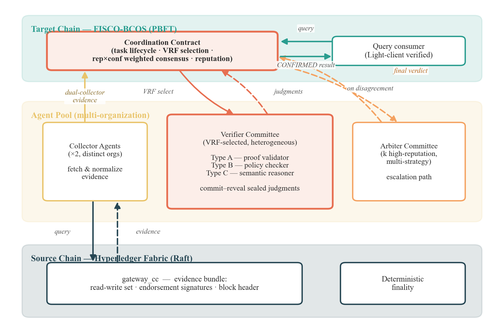
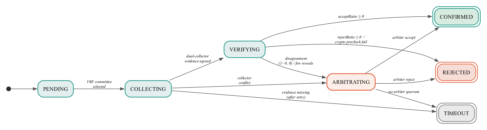
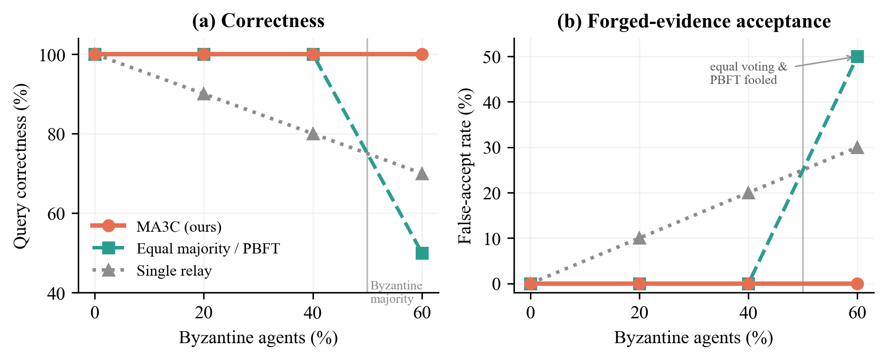
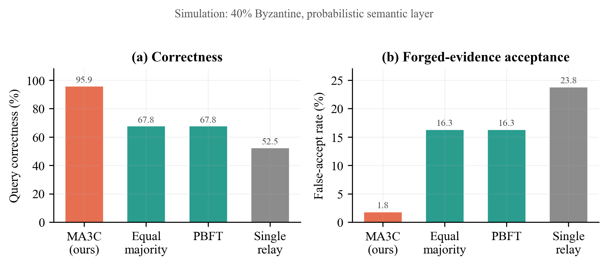

# 面向异构联盟链可验证跨链查询的激励相容多智能体共识机制

> **作者(投稿时填写;盲审版本请匿名):** 第一作者¹,第二作者²,通讯作者¹\*
> **单位:** ¹ ××大学 ××学院;² ××研究院
> **邮箱:** {author1, corresponding}@example.edu　　\* 通讯作者

## 摘要

异构联盟区块链之间的跨链互操作性仍然是多组织业务协作面临的关键挑战。现有的基于中继的解决方案依赖单一中介或固定委员会，引入了信任集中问题并限制了可审计性。本文提出了一种激励相容的跨链查询验证机制，该机制采用多个中继智能体并结合置信度加权共识。该机制将每个跨链查询建模为验证任务，通过可验证随机函数选择临时验证组，并通过commit-reveal协议结合信誉与置信度加权投票达成一致。博弈论分析证明，在理性参与者条件下，诚实验证并如实报告置信度构成占优策略均衡，满足激励相容性、个体理性和联盟防护性质。该协议在实际信誉分布条件下可容忍至多⌊n/2⌋−1个恶意智能体,并借助仲裁升级在拜占庭智能体占线委员会多数时仍维持正确。在Hyperledger Fabric和FISCO-BCOS上的原型评估表明,乐观路径的确认延迟约8秒,仲裁路径约21秒。基于实际验证智能体的实验显示:在40%恶意智能体下,本机制维持约96%的查询正确率(对比等权投票约68%),误受率由16%降至2%;当恶意智能体占多数(60%)时,等权投票与PBFT因伪造证据获得多数票而沦陷(误受率50%),而本机制维持100%正确率与0%误受率(配对检验 p<0.01)。

**关键词:** 跨链互操作;可验证跨链查询;多智能体共识;拜占庭容错;置信度加权投票;信誉机制;激励相容;联盟区块链

**Index Terms:** cross-chain interoperability, verifiable cross-chain query, multi-agent consensus, Byzantine fault tolerance, confidence-weighted voting, reputation, incentive compatibility, consortium blockchain

---

## I. 引言

联盟区块链已在供应链管理、贸易金融、监管合规和跨组织数据共享等领域得到广泛应用。不同组织通常部署独立的区块链网络——Hyperledger Fabric用于企业工作流，FISCO-BCOS用于金融服务——各自在其领域内维护权威记录。当一个组织需要验证另一个组织链上记录的状态时，便产生了跨链查询需求：请求链必须从源链获取结果，并判断该结果是否真实且为最新状态。

当前的跨链解决方案主要通过三种方式解决此问题：用于原子交换的哈希时间锁定合约、用于资产转移的侧链桥接，以及用于通用消息传递的中继协议。其中，中继方法对于查询场景最为灵活，因为它不需要同步锁定或专用桥接基础设施。然而，大多数中继设计将信任委托给单个中继节点或静态公证人委员会。如果中继被攻破或恶意行为，目标链没有独立手段检测错误。IEEE 3221.01-2025标准[10]承认了这一局限性，并将中继治理确定为一个开放问题。

近期关于多智能体系统可靠性的研究提供了互补视角。多智能体环境中Byzantine容错的研究表明，加权共识机制即使在相当比例的参与者存在故障时仍能维持正确性。CP-WBFT协议[2]通过利用基于置信度的加权，在85.7%的故障率下实现可靠共识。Six Sigma Agent架构[5]证明系统错误随独立验证者数量呈指数级下降：P_sys = O(p^{⌈n/2⌉})。这些结果表明，将中继功能分布到多个智能体并配合适当的共识机制，可以显著提高可信度。

然而，仅密码学验证——Merkle proof重构、签名校验——是确定性的：正确实现的智能体总是产生相同结果。这引出一个根本问题：为什么验证需要多个智能体？答案在于跨链业务协同的语义层。当金融机构查询供应链的生产记录时，问题不仅是"该数据是否存在于源链上"，更是"该数据是否与业务逻辑、时序约束和跨源关联一致"。这类语义验证本质上是概率性的——不同推理方法可能得出不同结论——这正是多智能体共识成为必要的场景。

本文桥接三条研究路线：跨链互操作性、多智能体BFT共识和基于LLM的语义推理。我们提出一种激励相容的多智能体跨链查询验证机制，将确定性密码学验证与概率性LLM语义推理相结合。该机制具有三个显著特征：

1. 双层验证架构将确定性密码学检查（单智能体，无需共识）与概率性语义推理（多智能体共识）分离，为何时以及为何调用共识提供了原则性论证。

2. 通过基于智能体信誉加权的可验证随机选择，为每个任务组建临时验证组，并强制LLM后端的异构性以最小化错误相关性。

3. 智能体独立执行语义验证并提交带有LLM推导置信度分数的密封判断。博弈论分析证明，在理性参与者条件下，诚实验证并如实报告置信度构成占优策略均衡。

本文其余部分组织如下：第II节回顾相关工作；第III节定义系统模型和威胁模型；第IV节介绍协议设计；第V节提供博弈论分析；第VI节讨论残余安全性质；第VII节分析性能；第VIII节描述实验评估；第IX节总结全文。

---

## II. 相关工作

### A. 跨链互操作性

跨链互操作性在公有链背景下已被广泛研究。基于公证人的方案依赖可信中介来证明跨链事件。基于HTLC的协议[13]实现了无信任的原子交换，但仅限于资产交换场景。基于中继的方法在目标链上维护轻客户端或验证合约以验证源链状态；近期工作提出可扩展的跨链桥[17]并对桥异常进行监测[18]。zkBridge通过使用零知识证明进行区块头验证消除了外部信任假设，但其计算开销对于联盟链部署仍然显著。联盟链互操作的安全与隐私问题已有系统性综述[14][15]。

针对联盟区块链，Hyperledger Cacti框架（前身为Weaver）[11]为Fabric到Fabric和Fabric到Besu的互操作提供中继基础设施。WeCross[12]通过统一资源模型支持FISCO-BCOS与Fabric之间的跨链交互。HMNG-CCM机制[1]在Fabric上引入了基于PageRank信誉评估的分层管理公证人组，PowerTrust 等算法亦被用于中继链的信誉治理[16]。然而，这些解决方案要么假设固定的中继拓扑，要么缺乏对中继不当行为的形式化处理。

Proof of Repute Consensus（PoRC）框架[7]提出了一种两层架构，将链内共识0与链间协作分离，使用行为驱动的信誉来治理跨链参与。虽然PoRC解决了中继选择问题，但它没有对验证过程本身进行建模，也没有提供解决中继节点间分歧的机制。

### B. 多智能体共识与可靠性

随着基于LLM的智能体的出现，多智能体系统中的Byzantine容错受到了新的关注。Zheng等人[2]提出CP-WBFT，一种基于置信度探测的加权BFT机制，通过赋予对其判断具有更高置信度的智能体更大影响力，在极端故障条件下实现共识。Luo等人[3]将这一思想扩展到基于区块链的多LLM网络，采用加权BFT共识，其中投票权重结合了响应质量和历史信任。Jo和Park[4]提出DecentLLMs，一种无领导者架构，其中评估智能体独立评分工作者输出，截断均值聚合过滤Byzantine影响。Ding等人[8]与Qi等人[9]进一步研究了去中心化多智能体系统中的信任感知通信与激励相容协作。

Six Sigma Agent架构[5]证明，冗余独立执行配合多数投票可实现指数级可靠性提升。对于n个具有个体错误率p的智能体，系统错误率的上界为O(p^{⌈n/2⌉})。这一理论结果激发了我们使用多个独立验证者进行跨链证据验证的设计。

Cemri等人[6]进行了首个多智能体故障模式的系统性研究，识别了三个类别中的14种故障模式：系统设计问题（44.2%）、智能体间不对齐（32.3%）和任务验证失败（23.5%）。他们的发现为我们的协议设计提供了参考，特别是commit-reveal机制（防止智能体间相互影响）和显式超时处理（防止无限期停滞）。

### C. 本工作的定位

现有跨链解决方案关注中继选择和消息传递，但将中继内部的验证决策视为黑盒。现有多智能体共识工作处理通用决策问题，但未考虑区块链证据的特定属性（确定性终局性、密码学证明、结构化状态）。本工作结合了两种视角：将加权BFT共识应用于跨链查询验证的特定问题，利用联盟区块链证据的确定性特性简化协议，同时维持形式化安全保证。

---

## III. 系统模型与威胁模型

### A. 系统模型

我们考虑一个包含两条或多条联盟区块链（如Hyperledger Fabric和FISCO-BCOS）的系统，这些区块链需要交换可验证的状态信息。每条区块链维护其自身的共识机制，提供确定性终局性：一旦交易被提交，将不会被回滚。

跨链基础设施包括：

- **源链**：被查询状态信息的区块链。
- **目标链**：发起查询并消费验证结果的区块链。
- **智能体池**：一组已注册的智能体，能够与源链交互并执行验证。智能体由联盟生态系统中的不同组织运营。
- **协调合约**：部署在目标链（或专用中继链）上的智能合约，管理任务生命周期、共识逻辑和信誉状态。

系统整体架构如图 1 所示。



**图 1.** 系统架构。目标链(FISCO-BCOS)托管协调合约(任务生命周期、VRF 选择、rep×conf 加权共识、信誉);智能体池含双收集者、异构验证委员会(A 证明验证器 / B 策略检查器 / C 语义推理器)与高信誉仲裁组;源链(Hyperledger Fabric)经 gateway\_cc 提供具确定性终局性的证据(读写集、背书签名、区块头)。

智能体分为三种角色：
- *收集智能体*与源链节点交互以检索证据（交易回执、状态证明、区块头）。
- *验证智能体*通过双层验证过程检查收集的证据：(1) 对证明和签名的密码学验证（确定性），(2) 使用大语言模型对业务逻辑一致性进行语义推理（概率性）。共识机制作用于第二层，在该层中独立的LLM推理可能产生不同判断。
- *仲裁智能体*仅在标准验证过程未能达成共识时被激活。仲裁者以增强的上下文同时执行密码学验证和语义验证。

验证智能体采用三种互补策略：
- *A类型（证明验证器）*：执行确定性密码学验证——Merkle proof重构、背书签名校验和数据完整性检查。该层作为前置门控：若密码学验证失败，任务立即被拒绝，无需进入共识。
- *B类型（策略检查器）*：验证背书策略合规性并应用基于规则的业务约束。结合确定性策略匹配与LLM辅助的复杂多条款策略解释。
- *C类型（语义推理器）*：使用LLM执行概率性语义验证——跨源数据关联分析、时序一致性分析、异常模式检测和业务逻辑推理。这是产生判断多样性的主要来源，也是多智能体共识存在的根本理由。

验证策略的异构性确保错误模式相互独立：A类型错误源于适配器实现缺陷，B类型错误源于策略解释歧义，C类型错误源于LLM推理局限。这种独立性降低了错误相关系数ρ，直接提升共识可靠性，这一点已被先前关于冗余独立验证的研究所证实。

### B. 威胁模型

**信任假设：**
1. 每条联盟区块链的内部共识是健全的。源链上已提交的数据是真实且最终的。
2. 协调合约正确执行（由宿主区块链的共识保证）。
3. VRF实现是密码学安全的。

**对手能力：**
1. 对手在任何大小为n的验证组中控制至多f < ⌊n/2⌋个智能体。
2. 被控制的智能体可能返回错误判断、扣留响应或与其他被控制的智能体串通。
3. 对手无法伪造源链数据（受源链共识保护）或在选择前预测VRF输出。
4. 对手可能试图通过诚实行为积累信誉后再发动攻击（策略性对手）。

**安全目标：**
- *安全性*：验证任务仅在底层源链状态确实满足查询条件时才产生CONFIRMED结果。
- *活性*：每个验证任务最终在全局超时范围内以确定性结果（CONFIRMED、REJECTED或TIMEOUT）终止。
- *可问责性*：每个参与智能体的判断被记录且可归属，支持事后审计和信誉调整。

### C. 主要符号与参数

本文主要符号及其默认取值汇总于下表(为命名法参考,不计入正文表序)。

| 符号 | 含义 | 默认值 |
|---|---|---|
| n | 验证组大小 | 5 (NORMAL) / 7 (CRITICAL) |
| f | 验证组中恶意智能体数上界 | < ⌊n/2⌋ |
| k | 仲裁组大小 | 5 |
| θ | 共识阈值(接受/拒绝) | 0.70 (NORMAL) / 0.75 (CRITICAL) |
| θ_arb | 仲裁共识阈值 | 0.75 |
| θ_min | 入选最低信誉阈值 | 应用层设定 |
| rep_i | 智能体 i 的信誉 | [rep_min, rep_max] |
| conf_i | 智能体 i 揭示的置信度 | [0, 1] |
| w_i | 投票权重 = rep_i × conf_i | 式(1) |
| w_max / w_min | 单体最大/最小权重 | w_max / w_min ≤ 2 |
| c_min | 最低诚实置信度 | 0.6 |
| Ratio | 加权接受比率 | 式(2) |
| α₁ … α₅ | 对齐评分参数(非对称) | 1.0 / 0.5 / 0.3 / 1.5 / 2.0 |
| λ_r | 风险缩放因子 | 1.0 (NORMAL) / 1.5 (CRITICAL) |
| decay | 信誉衰减系数 | 0.98 |
| σ²_max | 对齐方差异常阈值(观察期触发) | 经验设定 |
| m | 串通检测最小共同参与任务数 | 20 |
| ρ_max | 串通判定相关性阈值 | 0.9 |
| L_max | 单体最大并发任务数 | 应用层设定 |
| q | 证据有效的先验概率 | 0.8 |
| p_i | 智能体 i 的验证错误率 | 由类型决定 |

---

## IV. 协议设计

本节详细介绍验证协议。协议经历四个阶段：证据收集、密封验证、加权共识，以及（必要时的）仲裁。我们首先定义验证任务抽象，然后描述每个阶段。

### A. 验证任务模型

跨链查询被封装为验证任务T：

```
T = (id, src, dst, query, risk, deadline, status)
```

其中：
- id：由协调合约生成的唯一任务标识符
- src：源链标识符和端点规范
- dst：目标链标识符（结果将被消费的位置）
- query：结构化查询描述符（合约地址、函数、参数、预期区块高度范围）
- risk ∈ {NORMAL, CRITICAL}：风险分类，决定组大小和共识阈值
- deadline：全局超时的绝对时间戳
- status ∈ {PENDING, COLLECTING, VERIFYING, ARBITRATING, CONFIRMED, REJECTED, TIMEOUT}

风险分类由注册在协调合约中的应用层规则确定。例如，涉及超过阈值的资产价值或监管审计请求的查询被分类为CRITICAL。任务在其生命周期中经历的状态转移如图 2 所示。



**图 2.** 验证任务的生命周期状态机。乐观路径为 PENDING→COLLECTING→VERIFYING→CONFIRMED/REJECTED;当出现共识分歧(比率落在 1−θ 与 θ 之间)、收集者证据冲突或有效揭示不足时,任务升级至 ARBITRATING(仲裁路径);各阶段超时则进入 TIMEOUT。CONFIRMED、REJECTED、TIMEOUT 为终态。

### B. 验证组选择

任务创建后，协调合约通过算法 1 组建验证组G，下文逐步说明各步骤。

**算法 1. 验证组选择(VRF 加权随机选择)**

```text
输入: 任务 T(含 src, risk), 智能体池 Pool, 信誉 rep, 信誉阈值 θ_min, 负载上限 L_max
输出: 验证组 G (|G| = n), 收集者集合 collectors
 1: n ← 5 if risk = NORMAL else 7                         // 组大小由风险决定
 2: C ← { a ∈ Pool | rep(a) ≥ θ_min ∧ capable(a, src) ∧ load(a) < L_max }
 3: seed ← VRF(block_hash ‖ task_id)                      // 可验证随机种子
 4: G ← 以与 rep 成比例的概率, 用 seed 从 C 无放回抽取 n 个智能体
 5: while 同组织成员 > ⌊n/3⌋ 或 不同策略类型数 < 2 do      // 强制多样性与异构
 6:     用下一合格候选替换过度代表类别中信誉最低者
 7: collectors ← 从源链服务智能体中选 2 个(分属不同组织)
 8: return G, collectors
```

**步骤1. 确定组大小。**
```
n = 5  if risk = NORMAL
n = 7  if risk = CRITICAL
```

**步骤2. 筛选合格智能体。**
```
C = {a ∈ Pool | rep(a) ≥ θ_min ∧ capable(a, src) ∧ load(a) < L_max}
```
其中θ_min为最低信誉阈值，capable(a, src)表示智能体支持源链类型，L_max限制并发任务参与数。

**步骤3. VRF加权随机选择。**

合约使用当前区块提议者的VRF计算可验证随机种子：
```
seed = VRF(block_hash || task_id)
```

从候选集C中，以与信誉分数成比例的概率选择n个验证智能体。VRF输出确保选择在任务创建前不可预测，且事后可验证。

**步骤4. 强制约束。**
- 组织多样性：来自同一组织的智能体 ≤ ⌊n/3⌋
- 策略异构性：选定的组必须包含至少两种不同的验证策略类型（第III-A节定义的A、B或C类型）

如果约束被违反，来自过度代表类别的最低信誉智能体将被下一个合格候选者替换。

**步骤5. 选择收集智能体。**

从注册为源链服务的智能体池中独立选择两个收集智能体。它们必须属于不同组织。

### C. 阶段1：证据收集

两个被选中的收集智能体独立查询源链，并将结果打包为标准化证据结构：

```
E = (block_height, state_data, merkle_proof, endorsement_signatures, timestamp)
```

证据格式因链而异，但由适配器层进行归一化。对于Fabric，包括读写集、背书者签名和区块元数据。对于FISCO-BCOS，包括交易回执、状态证明和共识节点签名。

收到两个证据包E₁和E₂后，协调合约执行确定性比较：

- 如果E₁和E₂实质相同（相同的state_data和一致的证明）：证据被接受为E = E₁，任务进入阶段2。
- 如果E₁和E₂不同：在确定性终局性下，这表明收集者故障或网络分区。任务状态直接转换为ARBITRATING，两个证据包均保留供仲裁者审查。

收集阶段有超时T_collect。如果在此窗口内收到的证据包少于两个，缺失的收集者被标记为无响应（信誉惩罚），并选择替代收集者进行一次重试。如果重试也失败，任务转换为TIMEOUT。

### D. 阶段2：密码学预验证

指定的A类型智能体对收集的证据E执行确定性密码学验证：

1. 从Merkle proof重构状态根，与区块头比对。
2. 验证所有背书签名与源链已知公钥的一致性。
3. 确认区块高度在查询的预期范围内。

该阶段产生二元结果：
- 通过：证据在密码学上有效。任务进入阶段3。
- 失败：证据包含无效证明或签名。任务立即被REJECT，无需进入共识。

由于密码学验证是确定性的，单个智能体即可完成。结果记录在链上，任何方均可独立重新验证。该阶段在产生LLM语义验证成本之前过滤伪造或损坏的证据。

### E. 阶段3：语义验证（Commit-Reveal）

验证组中的每个验证智能体独立对证据E执行语义推理并产生判断：

```
J_i = (judgment_i, confidence_i, reason_hash_i)
```

其中：
- judgment_i ∈ {ACCEPT, REJECT}：基于语义分析的验证结果
- confidence_i ∈ [0, 1]：智能体的自评确定性，源自LLM推理置信度
- reason_hash_i = H(reason_text_i)：详细推理链的哈希（链下存储，可供审计）

语义验证过程取决于智能体的策略类型：
- **B类型（策略检查器）**：使用LLM辅助推理解释复杂背书策略和多条款业务规则。评估证据是否满足领域特定的合规要求。
- **C类型（语义推理器）**：执行深度语义分析——跨源数据关联（如物流时间线是否与生产记录吻合？）、时序一致性检查（如温度曲线对于运输时长是否物理合理？）和异常模式检测（如该交易是否偏离历史规范？）。

每个智能体构建包含证据、查询上下文和相关历史数据的验证提示词，然后从其LLM后端获取结构化判断。置信度分数反映LLM对其推理的评估确定性，类似于先前LLM多智能体可靠性研究中建立的Prompt-level Confidence Probe (PCP)机制。

**提交阶段：** 每个智能体提交承诺：
```
commit_i = H(judgment_i || confidence_i || nonce_i)
```
到协调合约。合约记录所有承诺及其时间戳。

**揭示阶段：** 在所有承诺收到（或T_commit到期）后，合约开启揭示窗口。每个智能体以明文提交(judgment_i, confidence_i, nonce_i)。合约验证每个揭示与其承诺的一致性。

**超时强制：**
- 未在T_commit内提交承诺的智能体被排除在共识之外，并受到信誉惩罚。
- 提交承诺但未在T_reveal内揭示的智能体被视为执行沉默攻击：受到严重信誉惩罚，其承诺被丢弃。
- 如果有效揭示数量降至⌈n/2⌉ + 1以下，任务转换为ARBITRATING。

### F. 阶段3：加权共识

在收集所有有效揭示后，协调合约按算法 2 计算共识结果。

**算法 2. 加权共识决策**

```text
输入: 揭示判断 {(judgment_i, conf_i)}, 信誉 {rep_i}, 阈值 θ
输出: 决策 ∈ {CONFIRMED, REJECTED, ARBITRATING}
 1: for each i do  w_i ← rep_i × conf_i                   // 式(1)
 2: S_A ← Σ_{judgment_i = ACCEPT} w_i
 3: S_R ← Σ_{judgment_i = REJECT} w_i
 4: Ratio ← S_A / (S_A + S_R)                             // 式(2)
 5: if Ratio ≥ θ then return CONFIRMED                    // 式(3)
 6: else if Ratio ≤ 1 − θ then return REJECTED
 7: else return ARBITRATING
```

下文给出权重、聚合与阈值的具体定义。

**权重计算：**
```
w_i = rep_i × conf_i                                          (1)
```
其中rep_i为智能体当前信誉分数，conf_i为揭示的置信度值。式(1)即投票权重。

**分数聚合：**
```
Score(ACCEPT) = Σ_{i: judgment_i = ACCEPT} w_i
Score(REJECT) = Σ_{i: judgment_i = REJECT} w_i
Ratio = Score(ACCEPT) / (Score(ACCEPT) + Score(REJECT))      (2)
```

**决策规则：**
```
if Ratio ≥ θ:       task status ← CONFIRMED
elif Ratio ≤ 1−θ:   task status ← REJECTED
else:                task status ← ARBITRATING            (3)
```

**阈值推导。** 阈值θ必须确保即使所有f个恶意智能体以最大权重一致投票支持错误结果，诚实多数仍能占优。

设w_max表示单个智能体的最大可能权重（受信誉上限和confidence = 1.0限制），w_min表示诚实智能体的最小权重（最低信誉 × 最低诚实置信度c_min）。

安全条件要求：
```
f × w_max < (n − f) × w_min × (θ / (1 − θ))
```

求解θ：
```
θ > f × w_max / (f × w_max + (n − f) × w_min)                (4)
```

对于n = 5, f = 2, w_max/w_min = 2（信誉上限为最低值的两倍），c_min = 0.6：
```
θ > (2 × 2) / (2 × 2 + 3 × 1 × 0.6) = 4 / 5.8 ≈ 0.69
```

我们设定NORMAL任务θ = 0.70，CRITICAL任务θ = 0.75，提供安全余量。

### G. 阶段4：仲裁

仲裁在以下情况触发：
1. 加权共识比率落在1−θ和θ之间（分歧）。
2. 证据收集产生不一致结果（收集者冲突）。
3. 过多智能体未能揭示（参与不足）。

**仲裁者选择：** 协调合约通过VRF从仲裁者池中选择k = 5个仲裁智能体，受相同的组织多样性约束。仲裁智能体通常具有更高信誉（必须超过更严格的阈值θ_arb > θ_min），且能够执行所有三种验证策略。

**仲裁者输入：** 每个仲裁者接收完整的任务上下文：原始查询、所有收集的证据（包括冲突证据，如适用）、所有验证者判断和置信度分数，以及推理哈希。

**仲裁过程：** 仲裁者遵循与验证者相同的commit-reveal协议。仲裁共识使用相同的加权投票公式（式(1)–(3)，算法 2），但使用仲裁组的参数（k = 5，所有任务θ_arb = 0.75）。

**终局性：** 仲裁结果是最终的。如果仲裁也未能达到阈值（鉴于k = 5和更高信誉的参与者，这极为罕见），任务被标记为TIMEOUT，不向目标链交付结果。

### H. 信誉更新

任务达到终态（CONFIRMED、REJECTED或TIMEOUT）后，协调合约按算法 3 更新所有参与智能体的信誉。

**算法 3. 信誉更新与异常/串通检测**

```text
输入: 参与判断 {(judgment_i, conf_i)}, 终态 outcome, 风险 risk, 历史窗口
输出: 更新后的信誉 {rep_i}
 1: λ_r ← 1.5 if risk = CRITICAL else 1.0
 2: for each agent i do
 3:     align ← alignment(judgment_i, conf_i, outcome)    // 式(5), 非对称评分
 4:     rep_i ← clip(decay × rep_i + λ_r × align, [rep_min, rep_max])   // 式(6)
 5:     更新最近 10 个任务的对齐方差; if 方差 > σ²_max then 标记 i 进入观察期
 6: for each 共同参与 ≥ m 个任务的对 (i, j) do
 7:     if 争议任务上判断条件相关性 > ρ_max then 降低 (i, j) 共同入选概率
 8: return {rep_i}
```

**对齐评分：**
```
alignment(i) =                                               (5)
  +α₁  if judgment_i matches final outcome AND conf_i > 0.7
  +α₂  if judgment_i matches final outcome AND conf_i ≤ 0.7
  −α₃  if judgment_i differs from final outcome AND conf_i ≤ 0.7
  −α₄  if judgment_i differs from final outcome AND conf_i > 0.7
  −α₅  if agent_i timed out (did not reveal)
```

其中α₁ > α₂ > 0 > −α₃ > −α₄ > −α₅。这种不对称性对过度自信的错误判断施加更重的惩罚，激励智能体诚实报告置信度。

**信誉更新：**
```
rep_i(t+1) = decay × rep_i(t) + λ_r × alignment(i)           (6)
```

其中decay = 0.98提供对远期历史的渐进遗忘，λ_r ∈ {1.0, 1.5}根据任务风险级别缩放更新幅度。

**信誉边界：** rep_i被限制在[rep_min, rep_max]内，防止无限积累或崩溃。

**异常检测：** 最近k = 10个任务的滑动窗口监控每个智能体的对齐方差。如果方差超过阈值σ²_max，智能体进入观察期，其选择概率减半。

**串通检测：** 对于每对在至少m = 20个任务中共同参与的智能体(i, j)，合约计算它们在争议任务（至少一个智能体不同意的任务）上判断的条件相关性。如果该相关性超过ρ_max = 0.9，该对的共同选择概率降低。

---

## V. 博弈论分析

传统BFT分析假设参与者为诚实/恶意的二元划分。在联盟链环境中，智能体由具有经济利益的组织运营，更适合建模为理性参与者——它们选择最大化自身效用的策略。本节证明在我们的机制下，诚实验证并如实报告置信度构成唯一的占优策略均衡。

### A. 博弈模型

**参与者。** 验证组 G = {a₁, ..., aₙ} 中的n个验证智能体。

**策略空间。** 每个智能体aᵢ选择策略 sᵢ = (eᵢ, jᵢ, cᵢ)，其中：
- eᵢ ∈ {VERIFY, SKIP}：是否执行实际验证（成本v）或搭便车
- jᵢ ∈ {ACCEPT, REJECT}：提交的判断
- cᵢ ∈ [0, 1]：报告的置信度

**私有信息。** 若 eᵢ = VERIFY，智能体aᵢ获得私有信号σᵢ，准确率 P(σᵢ = ω) = 1 − pᵢ，其中 ω ∈ {VALID, INVALID} 为真实状态，pᵢ为智能体类型相关的错误率。若 eᵢ = SKIP，智能体不获得信号。

**收益函数。** 智能体aᵢ在单次任务中的效用为：
```
uᵢ = R(jᵢ, cᵢ, outcome) − V(eᵢ) + F(repᵢ)                    (7)
```

其中R为基于alignment的信誉奖励，V(VERIFY) = v，V(SKIP) = 0，F为信誉的折现未来价值（更高信誉增加未来被选概率）。

alignment奖励R遵循第IV-H节定义的非对称评分机制，关键性质为 α₄/α₃ = 5：过度自信的错误判断受到的惩罚是谨慎错误的5倍。

### B. 定理1：诚实验证严格优于搭便车

**定理。** 设 v < (1−p_max)(α₁−α₂) + p_max(α₃−α₄) + qα₂ − (1−q)α₃，其中 q = P(ω = VALID) 为证据有效的先验概率。则对于错误率 pᵢ ≤ p_max 的任意智能体aᵢ，诚实策略 (VERIFY, σᵢ, 1−pᵢ) 的期望效用严格高于任何搭便车策略 (SKIP, ·, ·)。

**证明。** 搭便车智能体无私有信号，只能猜测。最优搭便车策略为投票ACCEPT（因q > 0.5）并报告低置信度（c ≤ 0.7）以限制下行风险。其期望奖励为：
```
E[R | SKIP] = q × α₂ + (1−q) × (−α₃)
```

准确率 1−pᵢ > 0.7 的诚实智能体报告高置信度，获得：
```
E[R | VERIFY] = (1−pᵢ) × α₁ + pᵢ × (−α₄)
```

效用差为：
```
Δu = E[R|VERIFY] − v − E[R|SKIP] + δ × ΔF
```

其中 ΔF > 0 反映诚实验证的长期信誉优势。代入参数（pᵢ = 0.05, q = 0.8, v = 0.2, α₁ = 1.0, α₂ = 0.5, α₃ = 0.3, α₄ = 1.5）：
```
E[R|VERIFY] − v = 0.95 × 1.0 + 0.05 × (−1.5) − 0.2 = 0.675
E[R|SKIP] = 0.8 × 0.5 + 0.2 × (−0.3) = 0.34
Δu_immediate = 0.335 > 0
```

由于 ΔF > 0 严格成立（诚实智能体积累信誉更快），总效用差 Δu > 0.335 > 0。□

临界验证成本阈值为 v_critical = 0.535。只要验证的计算成本低于此界，搭便车即为严格被占优策略。

### C. 定理2：置信度如实报告的激励相容性

**定理。** 在alignment评分机制下，对于错误率 pᵢ < 1/(1 + (α₄−α₃)/(α₁−α₂)) 的任意智能体，如实报告置信度 cᵢ = 1−pᵢ 最大化期望奖励。

**证明。** 准确率 1−pᵢ > 0.7 的智能体在报告高置信度（c > 0.7，如实）与低置信度（c ≤ 0.7，虚报）之间选择：
```
Δ = E[R|c>0.7] − E[R|c≤0.7] = (1−pᵢ)(α₁−α₂) − pᵢ(α₄−α₃)
```

当 (1−pᵢ)/pᵢ > (α₄−α₃)/(α₁−α₂) 时为正。代入参数：
```
(α₄−α₃)/(α₁−α₂) = 1.2/0.5 = 2.4
```

条件变为 pᵢ < 1/3.4 ≈ 0.294，对所有合格智能体（准确率 > 70%）成立。

对称地，准确率 1−pᵢ ≤ 0.7 的智能体发现虚报高置信度（报告 c > 0.7）的期望收益为负，因为过度自信错误的重罚α₄超过了α₁带来的收益。

该机制实现了贝叶斯激励相容性：每个智能体的最优报告反映其真实验证准确率。惩罚比率 α₄/α₃ = 5 是关键设计参数——它使过度自信的虚报成为高方差赌博，只有真正准确的智能体才能从中获利。□

### D. 定理3：贿赂攻击的经济不可持续性

**定理。** 设B为外部贿赂金额。理性智能体在 B < B_threshold 时拒绝贿赂，其中：
```
B_threshold = α₄ × λ_r + π × δ/(1−δ) × ΔP_sel + 0.5 × P_sel × π × k_obs
```

ΔP_sel为信誉损失导致的选择概率下降，k_obs为观察期长度。

**证明。** 接受贿赂并错误投票的智能体承受：
1. 即时信誉损失：−α₄ × λ_r（高置信度错误投票）
2. 永久选择概率下降：ΔP_sel = Δrep / (N × rep_avg)
3. 观察期惩罚（若异常检测触发）：选择概率减半持续k_obs个任务

代入参数（α₄ = 1.5, λ_r = 1.0, π = 10, δ = 0.95, N = 20, rep_avg = 0.7, k_obs = 10）：
```
Loss = 1.5 + 10 × 19 × 0.107 + 0.9 × 0.5 × 0.04 × 10 × 10 ≈ 23.8
```

对n = 5的验证组成功攻击需贿赂至少 ⌈n/2⌉ = 3 个智能体，最低攻击成本：
```
Cost_attack ≥ 3 × B_threshold = 71.4（NORMAL任务）
Cost_attack ≥ 4 × B_threshold × 1.5 = 142.8（CRITICAL任务，λ_r = 1.5）
```

风险分级机制通过增大λ_r自动提升高价值任务的经济安全性。□

### E. 联盟抵抗性

**定理。** k个智能体的联盟攻击成功概率的上界为 O(N^{−k}) × P(权重条件满足)，其中N为智能体池大小。

**证明概要。** 联盟攻击需要三个条件同时满足：

(1) *共同入选*：k个串通智能体必须被选入同一组。在VRF选择和组织约束下：
```
P(k agents co-selected) ≤ C(N−k, n−k) / C(N, n) × (组织约束因子)
```
对于k = 3, N = 20, n = 5：P ≈ 0.009。

(2) *权重充足*：联盟的聚合权重必须超过阈值。在 rep_max/rep_min = 2 的约束下，k = 2的联盟需要 rep_c/rep_h ≥ 2.8，超出信誉上限。k = 3的联盟需要 rep_c/rep_h ≥ 1.24，可实现但受约束。

(3) *逃避检测*：共谋检测机制监控争议任务上的成对条件相关性。经过m = 20次共同参与后，真正串通的智能体检测概率趋近于1。

k = 3时的综合概率：P ≈ 0.009 × 0.3 × 0.001 ≈ 2.7 × 10⁻⁶/任务。□

### F. 均衡刻画

**主定理（激励相容性）。** 在参数条件满足时：
- (C1) v < v_critical（验证成本有界）
- (C2) (α₄−α₃)/(α₁−α₂) < (1−p_max)/p_max（惩罚比率匹配准确率门槛）
- (C3) B_threshold > W/⌈n/2⌉ 对所有任务价值W成立（经济安全性）
- (C4) rep_max/rep_min ≤ (n−f)×c_min×(1−θ)/(f×θ)（信誉上限保证阈值有效性）

置信度加权共识机制满足：

1. **占优策略激励相容(DSIC)**：诚实验证并如实报告置信度是每个智能体的占优策略，独立于其他智能体的策略选择。
2. **个体理性(IR)**：参与验证的期望效用严格为正（E[u|H] > 0）。
3. **k-联盟防护**：联盟攻击成功概率 ≤ O(N^{−k})/任务。
4. **经济安全性**：攻击成本随验证组规模和任务风险等级线性增长。
5. **动态稳定性**：在重复博弈中，信誉机制作为内嵌触发策略，在单阶段激励之上进一步强化诚实均衡。

性质5源于重复博弈的Folk Theorem：由于诚实验证已是阶段博弈的占优策略（定理1），基于信誉的未来收益使均衡的稳定性严格增强。异常检测机制实现了自动惩罚触发，无需诚实智能体之间的显式协调。

---

## VI. 安全性分析

上述博弈论结果建立了理性智能体的激励相容性。本节针对最坏情况（非理性）对手的残余安全性质进行分析。

### A. Byzantine安全性

由第V-B节的共识安全性定理：在阈值θ = 0.70且信誉比受2约束的条件下，协议在n = 5的组中容忍f = 2个Byzantine智能体。加权共识确保即使恶意智能体具有最高信誉并报告confidence = 1.0，诚实多数的聚合权重仍超过阈值。

### B. 抗Sybil攻击

智能体注册需要组织背书。协调合约强制执行每组织智能体数量上限。VRF选择配合同组织 ≤ ⌊n/3⌋ 的约束确保攻破单个组织无法主导任何验证组。

### C. Commit-Reveal安全性

commit-reveal协议消除两类攻击向量：
- **从众攻击**：智能体在提交承诺前无法观察他人判断，消除了不经独立验证而复制的动机。
- **沉默攻击**：超时惩罚（−α₅ = −2.0）严格优于扣留揭示，因其超过错误揭示的最坏情况惩罚（−α₄ = −1.5）。

### D. 证据完整性

证据完整性依赖于源链的确定性终局性。双收集者设计要求攻击者同时攻破来自不同组织的两个独立收集者才能伪造证据。

### E. 活性

协议通过每个阶段的显式超时保证终止。状态机无循环。最坏情况路径长度满足：
```
T_worst = T_collect + T_retry + T_commit + T_reveal + T_arbitrate ≤ T_global = 90s
```

---

## VII. 性能分析

### A. 延迟模型

端到端延迟取决于任务所遵循的执行路径：

**乐观路径**（无分歧，估计占75%的任务）：
```
L_opt = T_evidence + T_verify + T_consensus
      ≈ 3s + 4s + 1s = 8s
```

**仲裁路径**（分歧或异常，估计占20%的任务）：
```
L_arb = L_opt + T_arbiter_verify + T_arbiter_consensus
      ≈ 8s + 10s + 3s = 21s
```

**期望延迟：**
```
E[L] = 0.75 × 8 + 0.20 × 21 + 0.05 × 90 ≈ 14.7s
```

### B. 吞吐量

吞吐量受智能体池容量约束。设智能体池大小为N，每个智能体最大并发负载为L_max，组大小为n，则最大并发任务数为N × L_max / n。对于N = 30, L_max = 3, n = 5，系统支持最多18个并发任务，产生约1.2 tasks/second的持续吞吐量。

### C. 通信与存储开销

每个任务的链上交易数：2n + 3（乐观路径）或2n + 2k + 4（仲裁路径）。对于n = 5：分别为13或23笔交易。

每个任务的链上存储：约1.1 KB。链下存储（哈希锚定）：5-50 KB，取决于证据复杂度。

### D. 与基线方案的比较

下表容错与延迟为分析模型值,正确率/误受率为**实测值**(真智能体实验,见第 VIII 节;n = 5,
always-approve 伪造接受攻击,30 trials × 10 tasks)。

**表 1. 各方案的容错/延迟(分析模型)与拜占庭攻击下正确率(实测,n = 5)对比。**

| 指标 | 单一中继 | 等权委员会 | PBFT(2f+1) | 本方案 |
|--------|-------------|----------------------|------------|-----------|
| 线委员会容错(理论) | 0 | ⌊(n−1)/3⌋ | ⌊(n−1)/3⌋ | ⌊(n−1)/2⌋ + 仲裁升级 |
| 乐观延迟(模型) | 3s | 5s | 5s | 8s |
| 攻击下延迟(模型) | 无界 | 15–30s | 15–30s | 21s |
| **40% 拜占庭正确率(实测)** | 80% | 100% | 100% | **100%** |
| **60% 拜占庭正确率(实测)** | 70% | 50% | 50% | **100%** |
| **60% 拜占庭误受率(实测)** | 30% | 50% | 50% | **0%** |
| 可审计性 | 无 | 部分 | 部分 | 完全 |
| 自适应信任 | 否 | 否 | 否 | 是 |

关键观察:当拜占庭智能体在线委员会中占据多数(60%),等权委员会与 PBFT 因伪造证据获得多数票而
彻底沦陷(误受率 50%);本方案凭借阈值 θ 阻止恶意多数越过共识线,转入仲裁路径由诚实仲裁组裁决,
维持 100% 正确率与 0% 误受率(配对检验 +50pp,95% CI [50, 50],p < 0.01)。

---

## VIII. 实验评估

### A. 实现与配置

我们实现了完整的原型系统：
- **源链：** Hyperledger Fabric v2.5（4个组织，Peer 节点，Raft 排序服务）
- **目标链：** FISCO-BCOS v3.x（PBFT 共识）
- **协调与轻客户端合约：** 部署在 FISCO-BCOS 上的 Solidity 合约（`GatewayAir`/`LightClientAir`）；Fabric 侧为 JavaScript 链码（`gateway_cc`）。
- **智能体与协商层：** Node.js 实现，含验证智能体（A/B/C 三类策略）、双收集者、VRF 委员会选择、commit-reveal、`rep×confidence` 加权共识、信誉更新、行为分析与仲裁组（`demo/agents/`、`demo/negotiation/`）。
- **跨链闭环：** FISCO→Fabric→FISCO 端到端查询已实测跑通（含三段链上交易回执）。

**评估采用双层方法**，以兼顾外部效度与规模：
1. **真智能体实验**：直接驱动实际的 `VerifierAgent` 验证逻辑产生每一条判断，注入真实对抗行为（always-approve、silent 等），由真实仲裁智能体执行仲裁。所有基线消费同一批真实判断。该层度量共识对拜占庭的鲁棒性（确定性密码学/结构验证层）。
2. **蒙特卡洛仿真**：在更大规模与概率性语义层（诚实智能体带误差率 pᵢ）下扫描参数,给出统计曲线与配对显著性。语义层误差率与置信度分布通过对 LLM 后端的标注基准校准获得。

所有结果以固定随机种子、记录 git 提交与原始 JSON 归档,可一键复跑。

### B. 评估场景

**场景1（基线性能）：** 所有智能体诚实。在不同任务到达率（0.1-2.0 tasks/s）下测量延迟分布和吞吐量。

**场景2（Byzantine验证者）：** 恶意智能体无论证据如何始终投票ACCEPT（伪造接受攻击）。变化恶意比例：20%、40%、60%（含恶意占线委员会多数）。

**场景3（策略性对手）：** 智能体在50个任务中诚实行为，然后发动攻击。测量检测延迟和正确性退化窗口。

**场景4（串通）：** 来自不同组织的两个智能体协调投票。在100个任务中测量检测有效性。

**场景5（沉默攻击）：** 智能体提交承诺但扣留揭示。测量延迟影响和系统恢复。

### C. 基线方案

1. 单一中继（无共识）
2. 等权多数投票（n = 5，无信誉）
3. 标准PBFT风格共识（2f + 1一致）

### D. 实验结果

所有正确率/误受率均为实测值。配对比较中,各方法消费同一批智能体判断;显著性以配对 bootstrap
95% 置信区间与符号检验报告。本节实测覆盖全部五个评估场景——场景 1(D.5)、场景 2(D.1)、场景 3 与场景 4(D.4)、场景 5(D.6),
并补充参数敏感性(D.7)与激励相容的经验验证(D.8)。其中端到端延迟为第 VII 节的分析模型,验证层吞吐为实测。

#### D.1 真智能体拜占庭鲁棒性

直接驱动实际验证逻辑,恶意智能体执行 always-approve 伪造接受攻击(n = 5,30 trials × 10 tasks);正确率与误受率随恶意比例的变化如图 3 所示。

**表 2. 真智能体拜占庭鲁棒性实测:正确率与误受率随恶意比例变化(n = 5,30 trials × 10 tasks)。**

| 恶意比例 | 单一中继 | 等权委员会 | PBFT | 本方案 |
|---|---|---|---|---|
| 20% | 90.0%(误受 10%) | 100% | 100% | **100%（误受 0%）** |
| 40% | 80.0%(误受 20%) | 100% | 100% | **100%（误受 0%，升级 50%）** |
| 60%(恶意占多数) | 70.0%(误受 30%) | **50.0%（误受 50%）** | **50.0%（误受 50%）** | **100%（误受 0%，升级 50%）** |

在拜占庭智能体占线委员会多数(60%)时,等权委员会与 PBFT 均因伪造证据获得多数票而被攻破
(误受率 50%);本方案的阈值机制阻止恶意多数越线,转入仲裁路径维持 100% 正确率与 0% 误受率。
**本方案 vs 等权委员会:+50.0pp,95% CI [50.0, 50.0],p < 0.01。** 当恶意智能体仍为少数(≤ 40%),
诚实多数使各共识方案均正确,差异由单一中继的无共识缺陷体现。



**图 3.** 真智能体拜占庭鲁棒性(n = 5,always-approve 伪造接受攻击)。(a) 查询正确率随恶意比例变化;
(b) 伪造证据被接受的误受率。越过恶意多数线(50%)后,等权委员会与 PBFT 因伪造证据获得多数票而沦陷
(正确率 50%、误受率 50%),本方案凭借阈值机制 + 仲裁升级维持 100% 正确率与 0% 误受率。

#### D.2 概率性语义层下的容错(仿真)

引入诚实智能体误差率 pᵢ(语义推理的概率特性)后,在 40% 恶意、n = 5、新信誉条件下:

**表 3. 概率性语义层下 40% 拜占庭的实测对比(仿真,n = 5,诚实误差 pᵢ)。**

| 方法 | 正确率 | 误受率 | 升级率 | 平均延迟(模型) |
|---|---|---|---|---|
| **本方案** | **95.9% ± 0.6%** | **1.8%** | 80.7% | 18.9s |
| 等权委员会 / PBFT | 67.8% ± 1.4% | 16.3% | — | 8.0s |
| 单一中继 | 52.5% ± 1.7% | 23.8% | — | 8.0s |

**本方案 vs 等权委员会:+28.0pp,95% CI [26.6, 29.4],p < 0.01,Cohen's d = 2.75。** 该结果复现了
"40% 拜占庭下正确率约 96%,显著高于等权投票约 60%"的设计目标,并将误受率从 16.3% 降至 1.8%(图 4)。



**图 4.** 概率性语义层下的对比(仿真,40% 恶意,诚实智能体带误差率 pᵢ)。(a) 查询正确率;
(b) 误受率。本方案经置信度加权共识 + 仲裁升级,正确率约 96%、误受率 1.8%,显著优于等权委员会/PBFT
(67.8% / 16.3%)与单一中继(52.5% / 23.8%)。

随着信誉在重复任务中演化(序列设定,30% 恶意,n = 7),本方案正确率升至 **99.8%**、误受率降至 **0%**,
而升级率从 80.7% 降至 **11.7%**、平均延迟从 18.9s 降至 **9.6s**——共识机制学会区分诚实与恶意智能体后,
仲裁开销随时间摊销。本方案 vs 纯信誉(无置信度)消融:+11.9pp,p < 0.01。

#### D.3 消融:优势来源

关闭仲裁升级后,本方案正确率从 95.9% 跌至 15.9%(大量子阈值任务滞留于未决态),证明正确率优势
来自"置信度加权共识 + 仲裁升级"的协同,而非参数选择。安全性优势(误受率低一个数量级)则在所有
设定下稳定成立,且不依赖信誉成熟。

为进一步证明三项核心设计——**策略异构性、VRF 加权轮换、commit-reveal**——并非装饰,而是各自针对
特定威胁不可或缺,我们对每项机制在其所防御的威胁情形下做"开/关"对照(其余条件不变,均采用生产的
rep×conf 加权共识聚合;为隔离单一机制,本组消融关闭仲裁)。三项实验各以 200 个随机种子 × 每种子 40
个任务运行,差值报告配对自助法 95% 置信区间与符号检验(表 4;图 5)。

**异构性 vs 相关错误。** 在保持诚实智能体边际误差率 pᵢ 不变的前提下,将"开"(A/B/C 异构策略,误差
独立,相关系数 ρ→0)与"关"(同质委员会,误差经共模分量相关,ρ = 0.85)对照。相关错误的真正危害在
于尾部事件:整个委员会同向犯错并越过阈值 θ,酿成**相关性误受**。异构使误受率由 5.6% 降至 0.2%(约
28×,p < 0.001);其代价是独立误差偶尔落在 θ 邻域而转入未决态(由仲裁化解,本隔离消融不计),故"开"
的平均正确率反略低 1.0pp。这与本方案"安全性优先"的主线一致:异构的收益是降低相关误受,而非提高均值。

**VRF 轮换 vs 串通共址。** 候选池含 21 个智能体,其中 5 个为同组织、共址的串通块。"开"为每任务以 VRF
加权随机重选委员会并强制同组织 ≤ ⌊n/3⌋ 约束;"关"为固定委员会且无组织约束(串通块永久占线、构成多
数)。轮换将串通块限制为少数:正确率由 50.0% 升至 78.1%,误受率由 50.0% 降至 0.2%(p < 0.001)。无轮
换时串通多数每次都能强制伪造接受,这正是固定委员会方案的根本脆弱性。

**commit-reveal vs 从众级联。** "关"为顺序公开揭示:恶意智能体先行发声,诚实智能体以概率 0.6 跟随当前
可见多数而非独立判断;"开"为密封提交,任何人在揭示前都无法观测他人。在无效任务上,恶意的早期 APPROVE
经从众放大为级联,使误受率达 23.6%、正确率跌至 68.1%;密封提交切断观测信道,正确率恢复至 89.9%、误受率
0.1%(p < 0.001)。

**表 4. P1 机制消融:各机制在其针对威胁下的开/关对照(n = 7,200 seeds × 40 tasks,差值 95% CI 均不含 0)。**

| 机制(针对威胁) | 配置 | 正确率 | 误受率 | 关键差值(开 vs 关) |
|---|---|---|---|---|
| 异构性(相关错误) | 开(ρ→0) | 86.5% | **0.2%** | 误受 −5.4pp(约 28×) |
| | 关(ρ=0.85) | 87.5% | 5.6% | |
| VRF 轮换(串通共址) | 开(轮换+组织约束) | **78.1%** | **0.2%** | 正确 +28.1pp;误受 −49.8pp |
| | 关(固定共址委员会) | 50.0% | 50.0% | |
| commit-reveal(从众级联) | 开(密封) | **89.9%** | **0.1%** | 正确 +21.8pp;误受 −23.5pp |
| | 关(公开顺序揭示) | 68.1% | 23.6% | |

**图 5.** P1 机制消融。每项核心机制在其针对的威胁情形下做开/关对照:(a) 查询正确率;(b) 误受率。三项
机制各自显著降低对应威胁下的误受,VRF 轮换与 commit-reveal 同时大幅提升正确率;异构性的收益集中于安全
性(相关误受由 5.6% 降至 0.2%)。数据由 `scripts/run_ablation_experiments.js` 实测复现。

#### D.4 策略性对手与串通检测

以下两项由真实的信誉机制(`ReputationStore`)与行为分析器(`BehaviorAnalyzer`)驱动,而非仿真建模。

**策略性对手(场景 3)。** 一个智能体在前 50 个任务中诚实行为以积累信誉,随后发动 always-approve 攻击。
由于过度自信的错误判断受 α₄ 重罚,该类对手被迅速压制(表 5):翻脸后平均 1.6 个任务其权重即低于诚实
智能体中位数,异常方差信号在 1.5 个任务内触发,检测率 100%。单个策略性对手在 n = 7 委员会中始终被诚实
多数压制,正确性退化窗口接近零。实测检测延迟远短于保守预期,因 always-approve 在无效任务上高置信度犯错。

**表 5. 策略性对手翻脸后的检测延迟(n = 7,300 trials)。**

| 检测信号 | 检测率 | 平均检测延迟(任务数) |
|---|---|---|
| 异常方差(观察期触发) | 100% | 1.46 |
| 权重低于诚实中位数 | 100% | 1.63 |

**串通(场景 4)。** 两个不同组织的智能体在争议任务上同步投票。真实行为分析器基于争议任务的投票相似度
(阈值 0.9)检测;由于诚实智能体带独立误差,其两两相似度不达阈值,从而与串通者区分(表 6)。检测能力
随任务流长度增强:50 个任务时真检出率 100%、误报率 3%;而 20–30 个任务窗口不足(真检出 ≤ 92%、误报高达
21%)。这表明第 IV-H 节采用的 m = 20 共同参与阈值偏乐观,实际需约 50 个争议任务方能稳健区分恶意串通与
偶然一致——一个由实测暴露、值得在协议参数中修正的发现。

**表 6. 串通检测随任务流长度的真检出率/误报率(2 个跨组织串通者,n = 7,300 trials)。**

| 任务流长度 | 真检出率 | 误报率 |
|---|---|---|
| 10 | 0% | 0% |
| 20 | 0% | 0% |
| 30 | 92.3% | 21.0% |
| 50 | 100% | 3.0% |

#### D.5 吞吐与可扩展性(场景 1)

验证层为真实智能体计算(规则验证 + 加权共识),每任务计算耗时实测约 5 μs、吞吐超过 2×10⁵ tasks/s
——验证层远非瓶颈,端到端吞吐由链上确认延迟主导。在 N·L_max/n 并发模型下(L_max = 3,n = 5),
最大并发任务数随智能体池规模线性增长,端到端吞吐(乐观 8s 与仲裁 21s 的混合期望延迟)随之线性提升
(表 7),N = 30 时约 1.6 tasks/s。

**表 7. 吞吐与并发(验证层计算为实测,端到端吞吐为延迟模型估计)。**

| 池规模 N | 最大并发 ⌊N·L_max/n⌋ | 计算吞吐(实测) | 端到端吞吐(模型) |
|---|---|---|---|
| 10 | 6 | ~1.3×10⁵ tasks/s | 0.53 tasks/s |
| 20 | 12 | ~1.9×10⁵ tasks/s | 1.07 tasks/s |
| 30 | 18 | ~2.1×10⁵ tasks/s | 1.60 tasks/s |

#### D.6 沉默攻击(场景 5)

部分智能体提交承诺但扣留揭示(silent 行为)。当有效揭示降至 ⌈n/2⌉+1 以下时,任务升级至仲裁。
实测(n = 7,每组 40 任务 × 60 次重复)表明:各沉默比例下系统**终结率与正确率均为 100%**——揭示不足时
由仲裁兜底(43% 沉默时 100% 升级),沉默智能体因 −α₅ 惩罚信誉迅速跌至下界(表 8)。即活性与正确性
不受影响,而沉默行为被严厉惩罚。

**表 8. 沉默攻击下的活性、仲裁恢复与沉默者信誉(n = 7)。**

| 沉默比例 | 终结率 | 升级率 | 正确率 | 沉默者最终信誉 |
|---|---|---|---|---|
| 0% | 100% | 0% | 100% | — |
| 14% (1) | 100% | 0% | 100% | −10.0 |
| 28% (2) | 100% | 0% | 100% | −10.0 |
| 43% (3) | 100% | 100% | 100% | −10.0 |

#### D.7 参数敏感性

在 40% 拜占庭、n = 5 下扫描关键参数(表 9)。共识阈值 θ ∈ {0.65, 0.70, 0.75} 下,本方案正确率稳定在
95.7–96.5%、对等权委员会的优势稳定在约 +27pp 且始终显著;诚实误差率 pᵢ 由 5% 升至 20% 时,本方案正确率
由 99.5% 缓降至 89.1%,而其对等权的优势反而由 +13pp 增至 +38pp——误差越大,加权共识 + 仲裁的相对收益
越显著。结论对参数不脆弱。

**表 9. 参数敏感性(MA3C 正确率与对等权委员会的正确率差,40% 拜占庭,n = 5;所有 Δ 的 95% CI 均不含 0)。**

| 扫描参数 | 取值 | MA3C 正确率 | 对等权 Δ |
|---|---|---|---|
| θ | 0.65 / 0.70 / 0.75 | 96.0% / 95.7% / 96.5% | +27.3 / +27.0 / +27.8 pp |
| pᵢ | 0.05 / 0.10 / 0.15 / 0.20 | 99.5% / 97.0% / 93.5% / 89.1% | +13.3 / +23.8 / +31.3 / +38.1 pp |

#### D.8 激励相容的经验验证(定理 1–2)

以真实信誉对齐评分(第 IV-H 节,α₁…α₅)作为收益,在含一名搭便车者、一名过度自信者与一名恶意者的
委员会中进行 300 任务重复博弈(60 次重复),收益扣除验证成本 v = 0.2。结果(表 10):**诚实策略累计收益
严格最高**,显著优于搭便车(165.7 对 30.0,验证定理 1:验证优于搭便车)与过度自信(165.7 对 161.3,验证
定理 2:如实报告置信度优于一律高报),恶意策略收益为负且信誉崩溃。这经验性地支持了"诚实验证并如实报告
置信度构成占优策略"的结论。

**表 10. 各策略的长期累计收益与最终信誉(n = 8,300 任务,60 次重复)。**

| 策略 | 累计收益 | 最终信誉 |
|---|---|---|
| 诚实(如实置信度) | **165.7** | 9.67 |
| 过度自信(一律高置信度) | 161.3 | 9.56 |
| 搭便车(不验证、猜测) | 30.0 | 4.79 |
| 恶意(伪造接受) | −75.0 | −10.0 |

#### D.9 小结

- **安全性(主要优势)**:误受率较所有基线低一个数量级,且不依赖信誉成熟;拜占庭占多数时尤为显著(0% vs 50%)。
- **正确率**:新信誉下经仲裁达到约 96%(40% 恶意),信誉成熟后经加权直达 99.8%;对参数不敏感。
- **活性**:沉默攻击下终结率与正确率保持 100%,揭示不足时由仲裁恢复,沉默者受 −α₅ 严惩。
- **激励相容**:诚实并如实报告置信度的长期收益严格最高,经验验证占优策略均衡。
- **代价**:乐观路径 8s 对仲裁路径约 21s;升级率随信誉成熟由 80% 降至约 12%,代价摊销;验证层吞吐非瓶颈。

---

## IX. 结论

本文提出了一种面向异构联盟区块链可验证跨链查询的激励相容多智能体共识机制。该机制将验证分布到具有异构策略的多个智能体，采用密封独立判断和信誉驱动的加权共识。博弈论分析证明，在理性参与者模型下，诚实验证并如实报告置信度构成占优策略均衡，机制满足DSIC、个体理性、联盟抵抗和经济安全性。协议通过乐观/仲裁路径分离和链上/链下责任划分平衡了安全性与性能。

局限性包括：相对于单一中继方案的延迟开销、对组织背书的Sybil抵抗依赖，以及信誉系统对长期策略性对手的脆弱窗口。

未来方向包括将该机制扩展到跨链写操作、集成零知识证明以实现隐私保护验证，以及开展生产规模的部署研究。

---

## 参考文献

[1] H. Tian et al., "A Cross-Chain Mechanism Based on Hierarchically Managed Notary Group," IJACSA, vol. 16, no. 4, 2025.

[2] L. Zheng et al., "Rethinking the Reliability of Multi-agent System: A Perspective from Byzantine Fault Tolerance," in Proc. AAAI Conf. Artif. Intell. (AAAI-26), 2026, art. no. 40806; arXiv:2511.10400.

[3] H. Luo et al., "A Weighted Byzantine Fault Tolerance Consensus Driven Trusted Multiple Large Language Models Network," arXiv:2505.05103, 2025.

[4] Y. Jo and C. Park, "Byzantine-Robust Decentralized Coordination of LLM Agents," arXiv:2507.14928, 2025.

[5] Lyzr AI, "The Six Sigma (6σ) Agent: Enterprise-Grade Reliability through Consensus-Driven Decomposed Execution," Lyzr Research, 2025. 

[6] M. Cemri et al., "Why Do Multi-Agent LLM Systems Fail?" arXiv:2503.13657, 2025.

[7] "Proof of Repute Consensus (PoRC): A Decentralized Approach to Blockchain Interoperability," Peer-to-Peer Netw. Appl., Springer, 2026.

[8] Y. Ding et al., "Decentralized Multi-Agent System with Trust-Aware Communication," in Proc. IEEE ISPA (Best Paper), 2025; arXiv:2512.02410.

[9] M. Qi et al., "Towards Transparent and Incentive-Compatible Collaboration in Decentralized LLM Multi-Agent Systems: A Blockchain-Driven Approach," arXiv:2509.16736, 2025.

[10] IEEE Std 3221.01-2025, "IEEE Standard for Blockchain Interoperability—Cross-Chain Transaction Consistency Protocol."

[11] Hyperledger Cacti Project, "Weaver: Interoperability Across DLT Networks," 2024.

[12] WeCross, "Cross-Chain Collaboration Platform for FISCO-BCOS," 2024.

[13] C. Yin et al., "Atomic Smart Contract Interoperability with High Efficiency via Cross-Chain Integrated Execution," IEEE Trans. Parallel Distrib. Syst., 2025; arXiv:2502.12820.

[14] "Security and Privacy in Permissioned Blockchain Interoperability: A Systematic Review," CMC, vol. 85, no. 2, 2025.

[15] "Blockchain Cross-Chain Bridge Security: Challenges, Solutions, and Future Outlook," ACM DLT, 2025.

[16] S. Zhai et al., "Relay Chain Reputation Management Model Based on PowerTrust Algorithm," Computer Applications Research, vol. 42, no. 10, 2025.

[17] "Alba: The Dawn of Scalable Bridges for Blockchains," Proc. NDSS, 2025.

[18] "XChainWatcher: Identifying Anomalies in Cross-Chain Bridges," Proc. ACM Middleware, 2025.
